# Hi there👋 
My name is Marek, I'm an MSc in Economics student and learning is my favorite thing.

### Interests 📚
- 📈 Mastering Metrics
- 📊 Strengthening Statistics
- 🎲 Building up Bayesics
- ✖️ Not Neglecting Numerics

### Toolkit 🛠️
- Stata, R, Python, Julia
  
### Education 🏫
- Onsite
  - 🐣 Math & Stats @ IES Charles University 🇨🇿
  - 🐥 Data Science @ SBE Maastricht University 🇳🇱
  - 🐔 Economics @ Stockholm School of Economics 🇸🇪 
  - 🐦 Econometrics @ IIES Stockholm University 🇸🇪 

- Online

  
  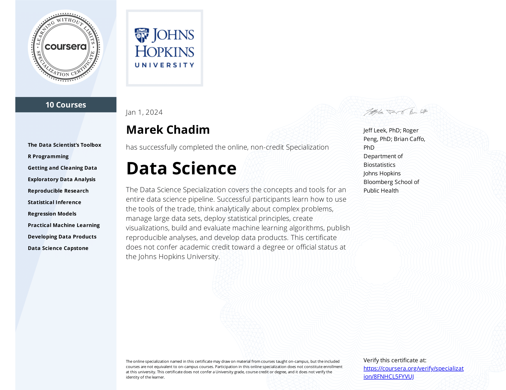
  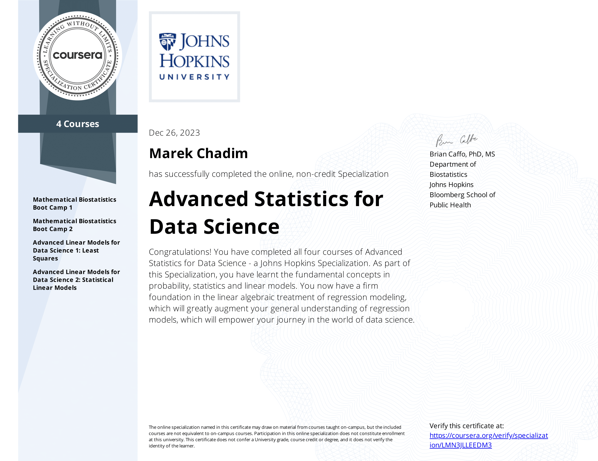
  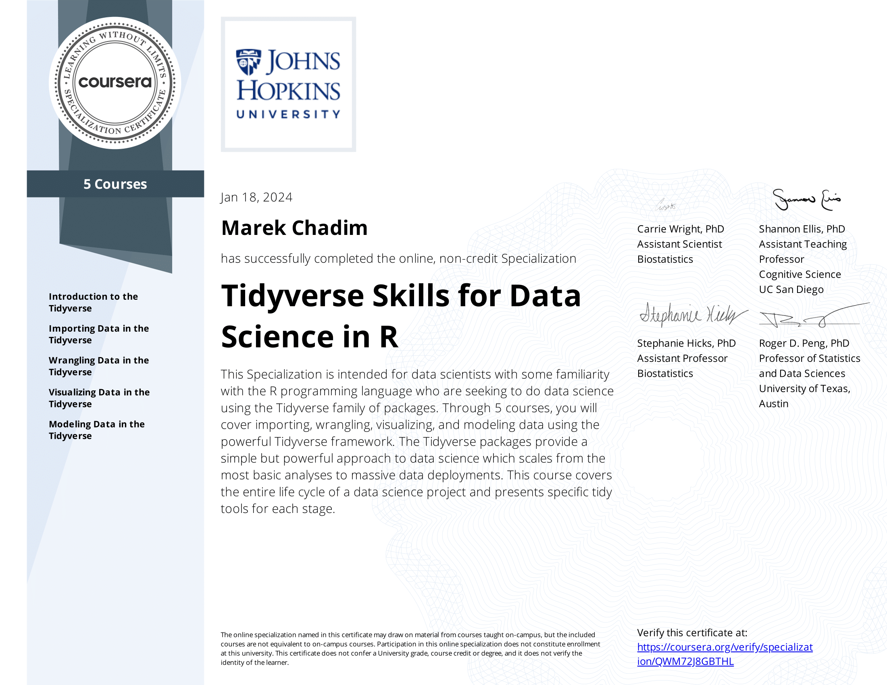
  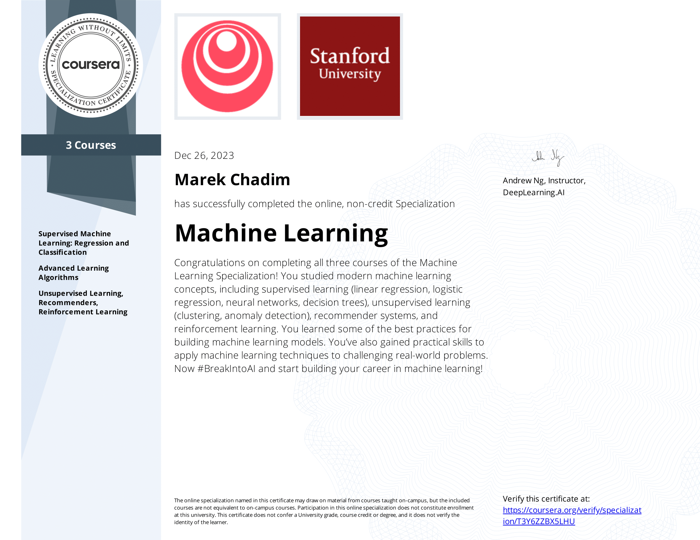
  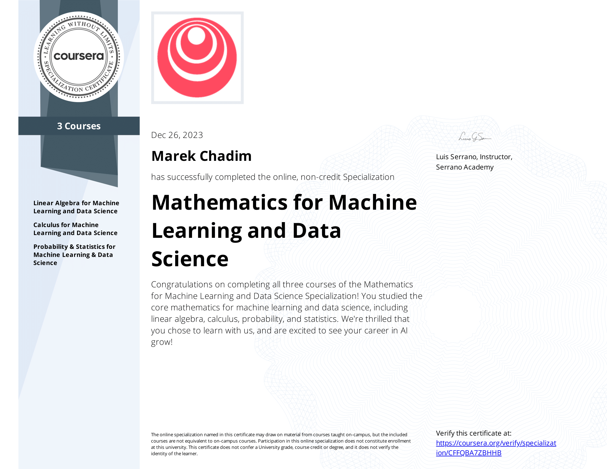
  

   
  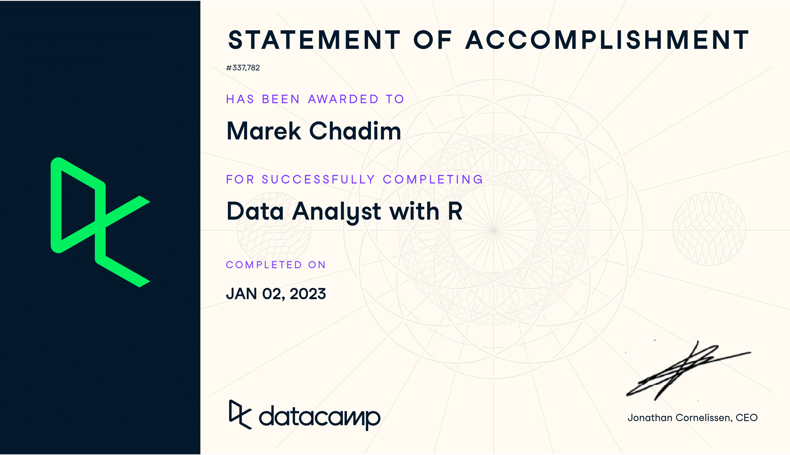
  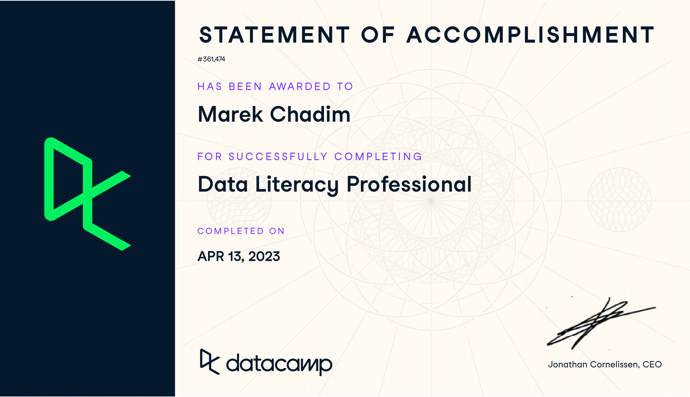
  

  

  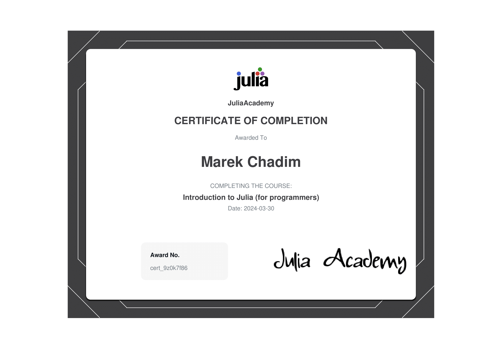
  
  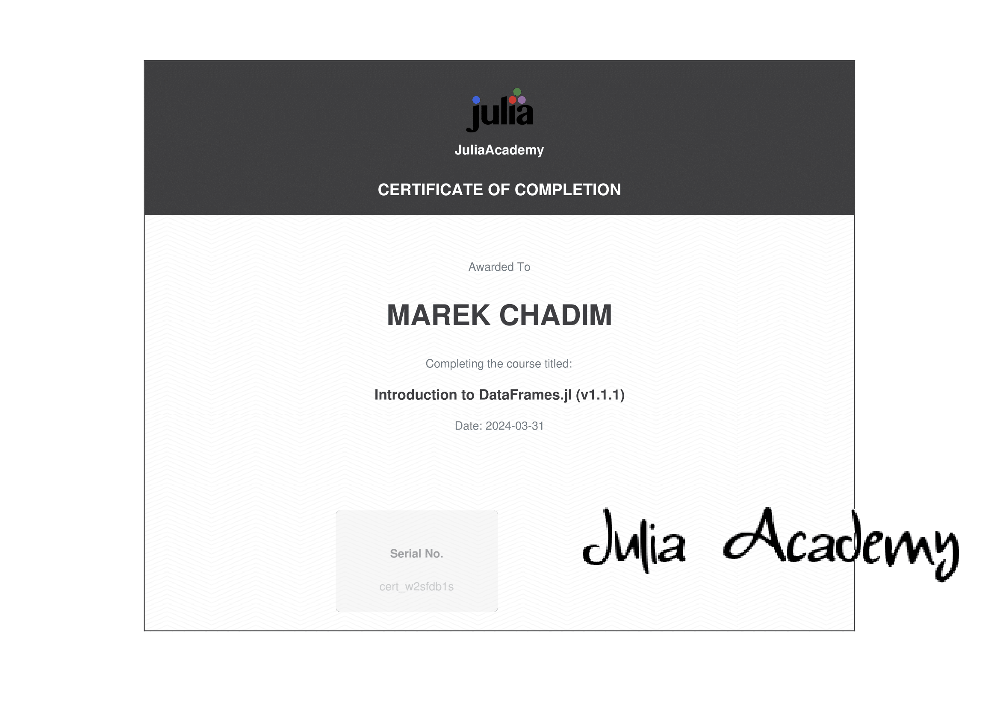
  

  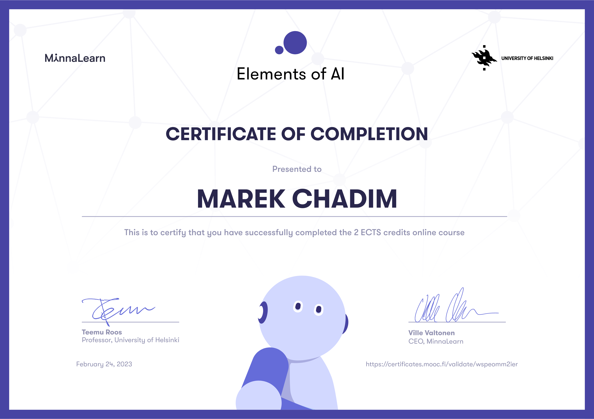 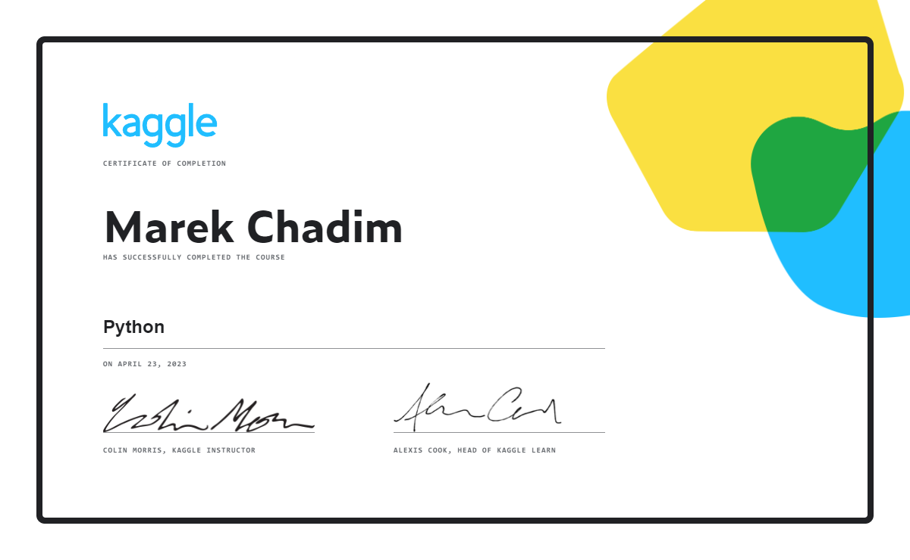
  

  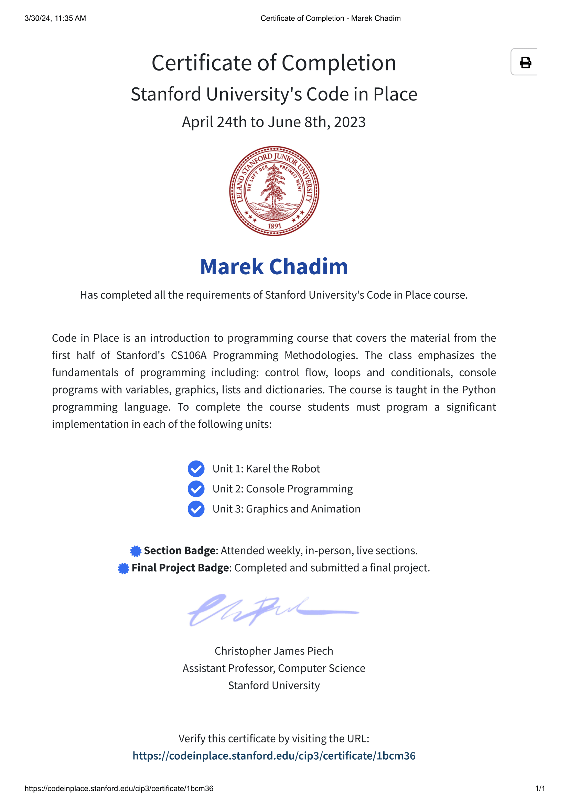

 

 

